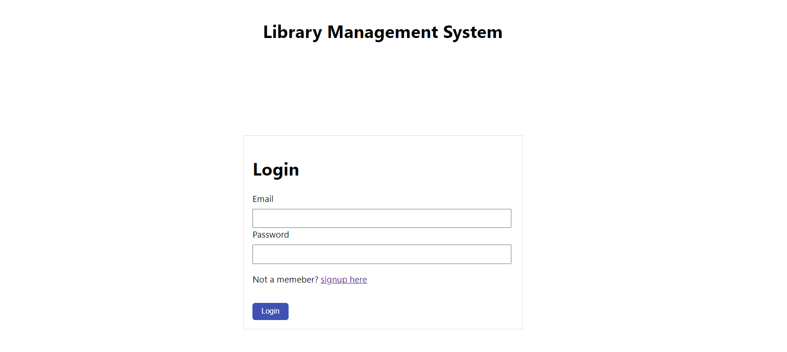
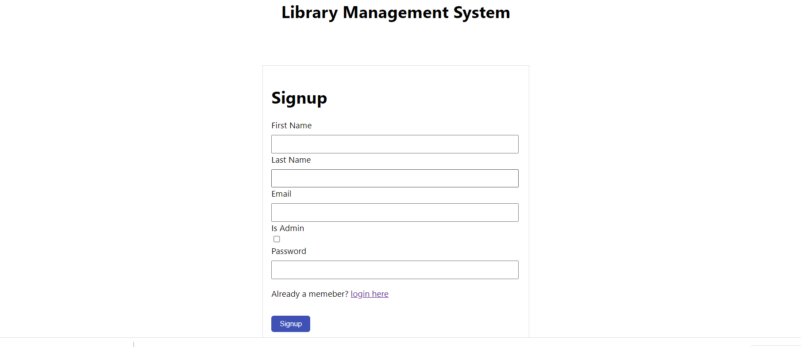
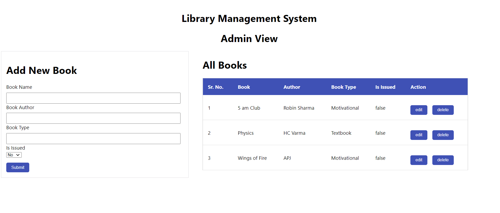
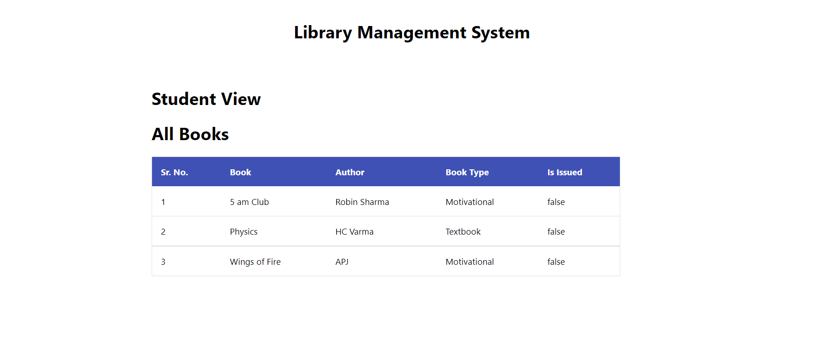

# Library Management System


## Functions
### Admin
- Create Admin account and Login.
- Can view all books
- Can add new book
- Can edit existing book information
- Can delete particular book

### Student
- Create account and Login.
- Can View all books
---


## API Development

- API deveoped in Python, Django Rest Framework by using class based and function based view methods

- API are authorized by custum permission classes for admin and student roles
## Database Details

- Database used: MySQL 
## How to Run This Project

- Install Python(3.7.6)
- Create mysql database and add details in settings.py file
- Open Terminal and Execute Following Commands :

```
python -m pip install -r requirements. txt
```
- Download This Project Zip Folder and Extract it
- Move to project folder in Terminal. Then run following Commands :
```
py manage.py makemigrations
py manage.py migrate
py manage.py runserver
```
- Now enter following URL in Your Browser Installed On Your Pc
```
http://127.0.0.1:8000/
```
## API References

User related APIs
- Login API
Login based on email and password
```
http://127.0.0.1:8000/accounts/login/
```
- Resgister API
Account details First Name , Last Name, Email, Password and User Type

```
http://127.0.0.1:8000/accounts/login/
```
Authorized APIs for Role Base Access for CRUD Operation
- View All Books
Admin and Student both can view all books
```
http://127.0.0.1:8000/api/allbooks/
```
- Create new book entry
Only admin can add new book, with details  like book name, book author , book type and book is issued or not
```
http://127.0.0.1:8000/api/allbooks/
```
- Edit Book details
Admin can edit book details on basis of id of object
```
http://127.0.0.1:8000/api/editbook/id/
```
- Delete Book
Only admin can delete book 
```
http://127.0.0.1:8000/api/deletebook/id/

```

## User Interference
- Login Page


- Signup Page


- Admin View



- Student View


## Drawbacks / LoopHoles
- Anyone can be Admin while signup
( we can manage this by giving admin to chnange user data in admin panel or through Django Admin panel )
